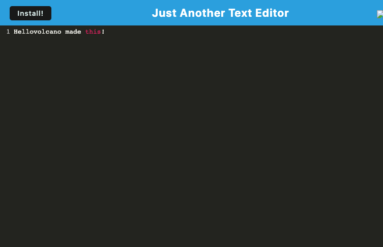

# Text Editor Starter Code
This project uses a combination of IndexedDB and Local Storage to create a simply text editor that will persist what you put in it--even after you've closed the browser! This application is also a Progessive Web App (PWA), leveraging a service worker built by Workbox to make it available offline, adn installable locally.

## Links
- [Deployed Application](https://)

## Screenshot

## Technologies Used
- Node JS
- Express
- IndexedDB
- Webpack
- Workbox 

## Installation Instructions
Complete the following steps to run this application locally:
1. Run `npm install` to install dependencies
2. Run `npm start` to start the server

## Questions
For issues or questions, contact [Valerie](https://www.github.com/hellovolcano) at[hellovolcano@gmail.com](mailto:hellovolcano@gmail.com)